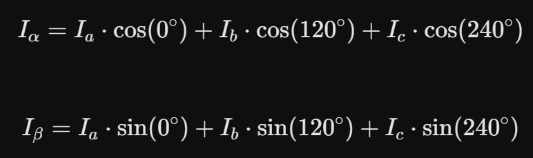
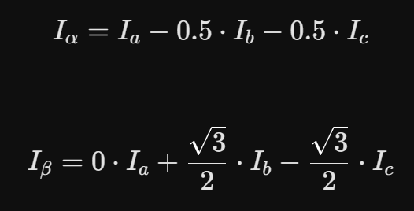
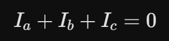
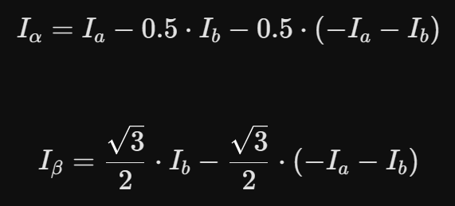
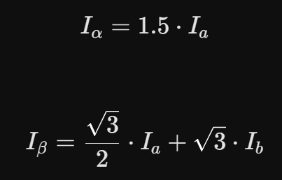
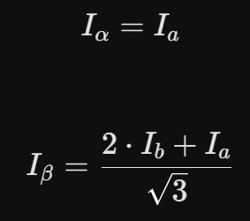
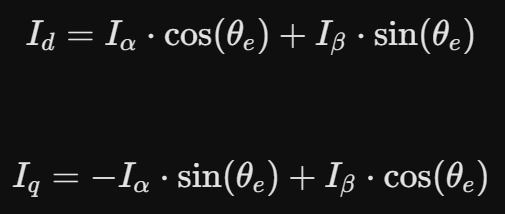

# Forward Park and Clarke Transformations

The FOC algorithm needs the I_d and I_q currents, calculated from I_a, I_b and I_c, which are the currents that go through each phase of the brushless motor. To do this, we need two transformations: the Park Transformation and the Clarke Transformation. 

Clarke Transformation

We have to project into I_alpha and I_beta axis (two new two-axis cartesian system) the 120° out of phase I_a, I_b and I_c vectors. With simple trigonometry we get:

Which is:

We know because of Kirchhoff that:

So we substitute I_c with -I_a-I_b. Developing:

Then we multiply by 2/3 to ensure the transformation is amplitude-invariant:

With those equations we have to read just two ADCs instead of three in the ESP32-S3 SuperMini, saving both pins and processing time.

Park Transformation

We create now a new two-axis cartesian system, formed by I_d and I_q. A new variable, called theta_e, is an angle. It is the phase offset between the center of the magnet 1 and the center of the coil 1. When the magnet 1 and the coil 1 are facing, theta_e = 0 rad. The reference system after the Clarke Transformation is fixed to the stator (coils), but after the Park Transformation it rotates with the rotor (magnets). So we just have to project I_alpha and I_beta into I_d and I_q. With theta_e = 0, I_alpha = I_d.

That way, we get:

To avoid calculating the same sinf(theta_e) and cosf(theta_e) (the suffix "f" means "float". It uses just 32 bits instead of 64, making a huge difference in the processing time) twice, we can assign a variable beforehands to conserve the result and use it directly in both equations.
