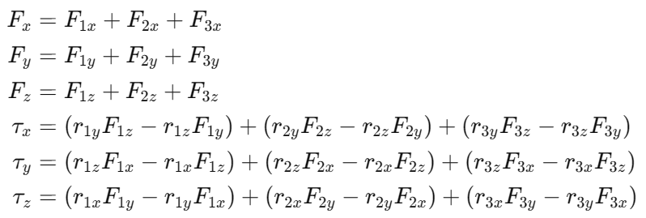

This section explains how the system calculates gimbal servo angles and main motor thrust to produce the desired rotation and translation of the drone.

First of all, these are simple 3D dynamics equations:

