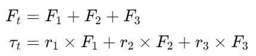

This section explains how the system calculates gimbal servo angles and main motor thrust to produce the desired rotation and
translation of the drone.

First of all, these are simple 3D dynamics equations:

F_i is the thrust vector the motor i produces, and r_i is the position vector of the center motor i, being this point where
the vector F_i starts.

If we develop the previous equations:

