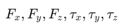
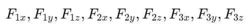
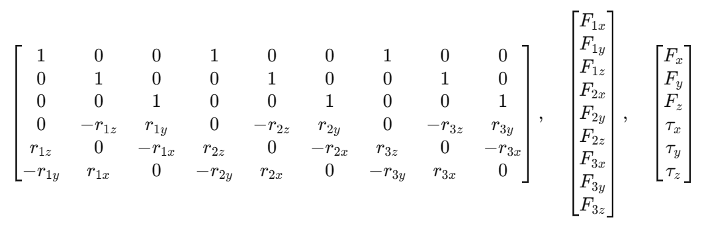
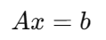
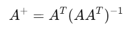
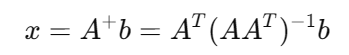

This section explains how the system calculates gimbal servo angles and main motor thrust to produce the desired rotation and
translation of the drone.

First of all, these are simple 3D dynamics equations:

F_i is the thrust vector the motor i produces, and r_i is the position vector of the center motor i, being this point where
the vector F_i starts.

If we develop the previous equations:

Those six equations form a system of equations of the drone dynamics, but we have to define clearly the unknowns and the 
determined values. The determined values are sent by the remote controller, and are the six expresions at the left side of the six previous equations:

And then we have nine unknowns:

Those are all the vector components of the three thrust vectors (three motors, three components each).
To manage all this we can create matrices. The matrix A will be the six equations, the matrix x will be the nine unknowns
and the matrix b will be the six determined values. The matrices are the following:

They form this matricial system of equations:

That system is underdetermined, so we have to find the most efficient solution in the 3D solution space. That solution is 
the minimum-norm one, the most energy-efficient solution. To find it, we resort to the Moore-Penrose pseudoinverse. The 
formula for a system that has less lines than columns (6x9) is the following:

And the minimum-norm solution is:

